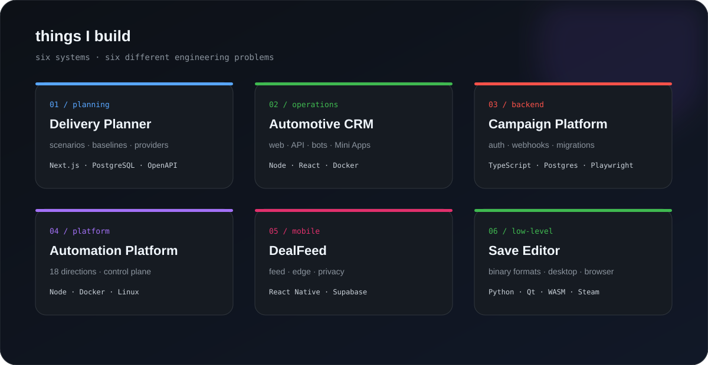
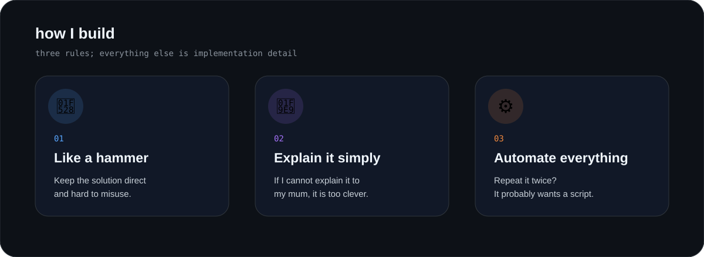

<p align="center">
  
</p>

<p align="center">
  
  
  
  
  
  
  
</p>

<p align="center">
  
</p>

## <code>&gt; two_lanes</code>

<p align="center">
  
</p>

The separation is intentional: **résumé facts describe what I lead professionally; GitHub shows what I build myself.**

<br/>

## <code>&gt; featured_builds</code>

<p align="center">
  
</p>

<table>
<tr>
<td width="50%" valign="top">

### 🧭 [Delivery Planner](https://github.com/Dmitriy-DE/delivery-planner-showcase)

Planning / governance platform with a real domain model rather than a prettier task list.

<code>Next.js</code> · <code>Node.js</code> · <code>PostgreSQL</code> · <code>Drizzle</code> · <code>OpenAPI</code>

**Built around:** planning semantics, scenarios, baselines, resource demand, provider adapters, auditability.

</td>
<td width="50%" valign="top">

### 🚗 [Automotive CRM](https://github.com/Dmitriy-DE/automotive-crm-showcase)

Operational CRM spanning web, API, bots and Telegram Mini Apps.

<code>Node.js</code> · <code>Express</code> · <code>React</code> · <code>SQLite</code> · <code>Docker</code>

**Built around:** one business domain exposed through several runtime surfaces.

</td>
</tr>

<tr>
<td width="50%" valign="top">

### 📣 [Campaign Platform](https://github.com/Dmitriy-DE/campaign-platform-showcase)

Backend-heavy campaign and user-operations system.

<code>TypeScript</code> · <code>Express 5</code> · <code>PostgreSQL</code> · <code>Docker</code> · <code>Playwright</code>

**Built around:** APIs, webhooks, auth, imports, operations, migrations and testing.

</td>
<td width="50%" valign="top">

### 🎰 [Automation Platform](https://github.com/Dmitriy-DE/igaming-automation-platform-showcase)

An 18-direction private monorepo turned into a public platform-engineering case study.

<code>Node.js</code> · <code>PostgreSQL</code> · <code>Docker</code> · <code>Linux</code>

**Built around:** service boundaries, shared infrastructure, control plane, schedulers and deployment automation.

</td>
</tr>

<tr>
<td width="50%" valign="top">

### 🛍️ [DealFeed](https://github.com/Dmitriy-DE/dealfeed-showcase)

TikTok-style shopping feed for mobile.

<code>React Native</code> · <code>Expo</code> · <code>TypeScript</code> · <code>Supabase</code> · <code>PostHog</code>

**Built around:** ingestion, RLS, Edge Functions, affiliate redirects, analytics and GDPR flows.

</td>
<td width="50%" valign="top">

### ☢️ [S.T.A.L.K.E.R. Save Editor](https://github.com/Dmitriy-DE/stalker-save-editor-showcase)

Desktop + CLI + browser save tooling on one Python core.

<code>Python</code> · <code>Qt</code> · <code>Pyodide</code> · <code>WebAssembly</code> · <code>Steam API</code>

**Built around:** binary formats, safe mutation, native boundaries, packaging and browser execution.

</td>
</tr>
</table>

<br/>

## <code>&gt; how_i_build</code>

<p align="center">
  
</p>

<details>
<summary><b>What follows from those three rules</b></summary>

```text
fewer moving parts
clear boundaries
visible failure
small deployable pieces
boring infrastructure where possible
tests around behaviour
automation around repetition
```

</details>

<br/>

## <code>&gt; current_build_mode</code>

~~~text
product tools
backend systems
automation
developer / delivery tooling
cloud & edge runtimes
AI-assisted build workflows
things that remove repetitive work
~~~

<br/>

## <code>&gt; contact</code>

<p align="center">
  <b>Professional:</b> Technical Delivery Lead · Technical Program Manager · Head of Delivery · Technical PM
  <br/>
  <b>GitHub:</b> products · tooling · backend · automation
</p>

<p align="center">
  <a href="https://github.com/Dmitriy-DE">
    
  </a>
</p>
