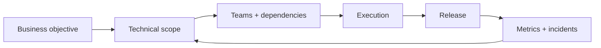

<p align="center">
  
</p>

<p align="center">
  
</p>

<p align="center">
  
  
</p>

<br/>

## <code>&gt; whoami</code>

I work where **engineering, product and delivery** meet — turning unclear goals, cross-team dependencies and technical constraints into something teams can actually ship.

My background spans **SaaS, fintech, iGaming, infrastructure, mobile and web products**, from hands-on project delivery to programme-level coordination with CTOs and engineering leadership.

### Management snapshot

<p>
  
  
  
  
</p>

- Led delivery for engineering teams and cross-functional product squads.
- Worked directly with **CTOs, Engineering Leads, Product, Operations and external partners**.
- Managed **roadmaps, release planning, dependencies, RAID, delivery forecasting and incident follow-ups**.
- Typical delivery cadence: **2-week sprints** and multi-feature releases with parallel workstreams.
- Built delivery processes around **clear ownership, measurable outcomes, predictable releases and fast escalation**.

<table>
<tr>
<td width="50%" valign="top">

### ⚙️ Delivery

- Cross-functional programmes
- Release & delivery governance
- Dependency management
- RAID & forecasting
- Incident follow-ups
- OKRs / KPIs
- Team leadership

</td>
<td width="50%" valign="top">

### 🧩 Technical

- Product engineering
- Backend & automation
- Cloud / CI/CD
- APIs & integrations
- PostgreSQL
- Telegram tooling
- AI-assisted development

</td>
</tr>
</table>

<br/>

## <code>&gt; toolkit</code>

<p align="center">
  
</p>

<p align="center">
  
  
  
  
  
  
  
</p>

<br/>

## <code>&gt; selected_work</code>

A mix of products and systems I've **built, contributed to, or helped deliver**.  
Some commercial work is intentionally **anonymised** because the repositories and client details are private.

### Public / personal work

| | Project | Description |
|:--:|---|---|
| 🧭 | **Project Planning Platform** | Planning and delivery tooling for roadmaps, execution visibility, workflow automation and project operations |
| 🚗 | **CRM Platform** | Operational CRM for an automotive business: customer workflows, internal operations, data handling and process automation |
| ☢️ | **S.T.A.L.K.E.R. Save Editor** | Cross-platform desktop tooling for inspecting and modifying game saves, packaged for end users |
| 🔎 | **Telegram / OSINT tooling** | Bot-driven automation, data processing and workflow tooling around Telegram |

### Private commercial work — anonymised

<table>
<tr>
<td width="50%" valign="top">

#### 🎰 B2B iGaming Platform

Technical delivery across a production iGaming environment with multiple parallel workstreams.

- 4+ years in iGaming
- Engineering teams of roughly 5–30 people
- 2-week sprint cadence
- Multi-feature releases
- Cross-team dependencies
- Release governance
- Production incident follow-ups
- OKRs, KPIs and RAID

</td>
<td width="50%" valign="top">

#### 💳 Fintech & Payments

Delivery of regulated financial products and payment infrastructure.

- Card and account-based products
- Crypto-to-fiat flows
- KYC / AML integrations
- Custody, exchange and ledger integrations
- Third-party vendor coordination
- Compliance-driven delivery constraints
- Business-critical integrations

</td>
</tr>
<tr>
<td width="50%" valign="top">

#### ☁️ Enterprise SaaS & Cloud

Delivery around cloud-native platforms and operational infrastructure.

- AWS-based environments
- Containerised workloads
- CI/CD and release processes
- Reliability and operational workflows
- Customer-facing SaaS delivery
- Infrastructure / application dependencies

</td>
<td width="50%" valign="top">

#### 📱 Mobile & Web Products

Cross-functional delivery across consumer and B2B applications.

- iOS / Android / backend coordination
- Product + engineering planning
- API and integration dependencies
- Release sequencing
- Stakeholder management
- Distributed teams

</td>
</tr>
</table>

<br/>

## <code>&gt; operating_model</code>



<p align="center">
  <b>Clear ownership · Visible risk · Predictable delivery · Fast feedback</b>
</p>

<br/>

## <code>&gt; current_focus</code>

```text
01  AI-assisted software delivery
02  Developer productivity & delivery automation
03  Cloud-native systems and operational tooling
04  Fintech / payment infrastructure
05  Building small products that solve annoying real problems
```

<br/>

<p align="center">
  
</p>