<p align="center">
  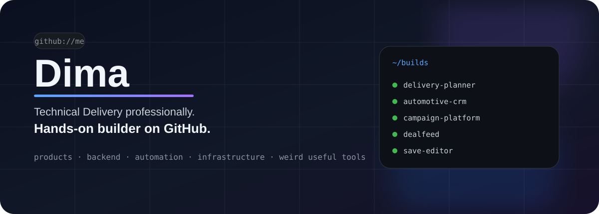
</p>

<p align="center">
  
  
  
  
  
  
  
</p>

<p align="center">
  
</p>

## <code>&gt; two_lanes</code>

<p align="center">
  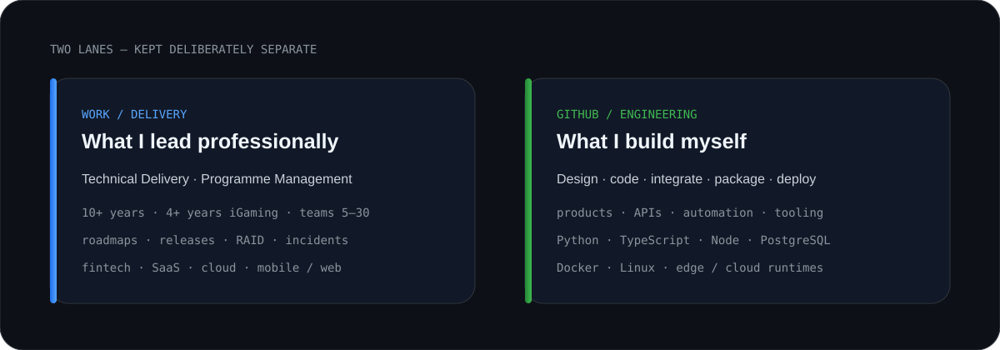
</p>

<p align="center">
  <sub>Résumé facts describe what I lead professionally. GitHub shows what I build myself.</sub>
</p>

<br/>

## <code>&gt; featured_builds</code>

<table>
<tr>
<td width="50%" align="center">
  <a href="https://github.com/Dmitriy-DE/delivery-planner-showcase">
    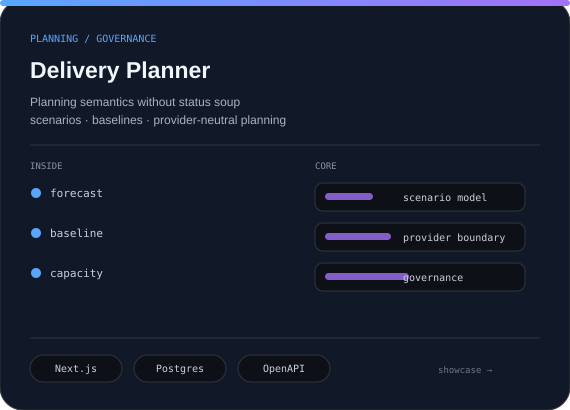
  </a>
</td>
<td width="50%" align="center">
  <a href="https://github.com/Dmitriy-DE/automotive-crm-showcase">
    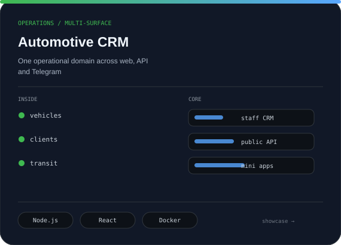
  </a>
</td>
</tr>
<tr>
<td width="50%" align="center">
  <a href="https://github.com/Dmitriy-DE/campaign-platform-showcase">
    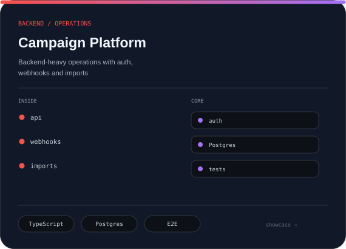
  </a>
</td>
<td width="50%" align="center">
  <a href="https://github.com/Dmitriy-DE/igaming-automation-platform-showcase">
    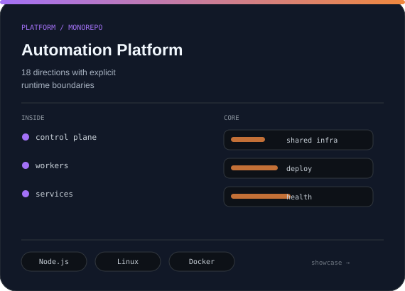
  </a>
</td>
</tr>
<tr>
<td width="50%" align="center">
  <a href="https://github.com/Dmitriy-DE/dealfeed-showcase">
    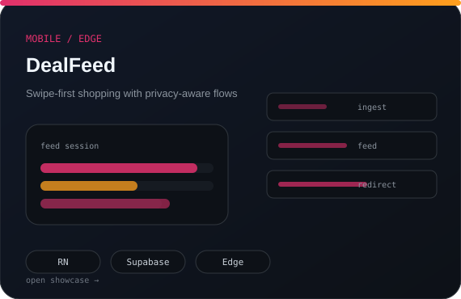
  </a>
</td>
<td width="50%" align="center">
  <a href="https://github.com/Dmitriy-DE/stalker-save-editor-showcase">
    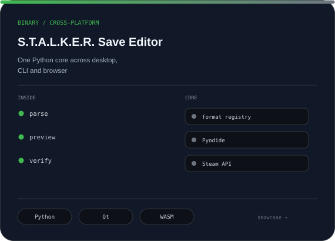
  </a>
</td>
</tr>
</table>

<br/>

## <code>&gt; how_i_build</code>

<p align="center">
  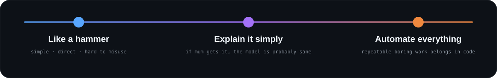
</p>

<details>
<summary><b>Everything else follows from those three rules</b></summary>

```text
fewer moving parts
clear boundaries
visible failure
small deployable pieces
boring infrastructure where possible
tests around behaviour
automation around repetition
```

</details>

<br/>

## <code>&gt; current_build_mode</code>

<p align="center">
  
</p>

<br/>

## <code>&gt; contact</code>

<p align="center">
  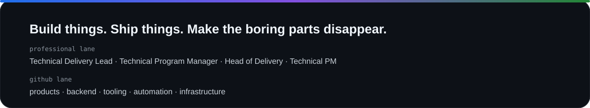
</p>

<p align="center">
  <a href="https://github.com/Dmitriy-DE">
    
  </a>
</p>
