

  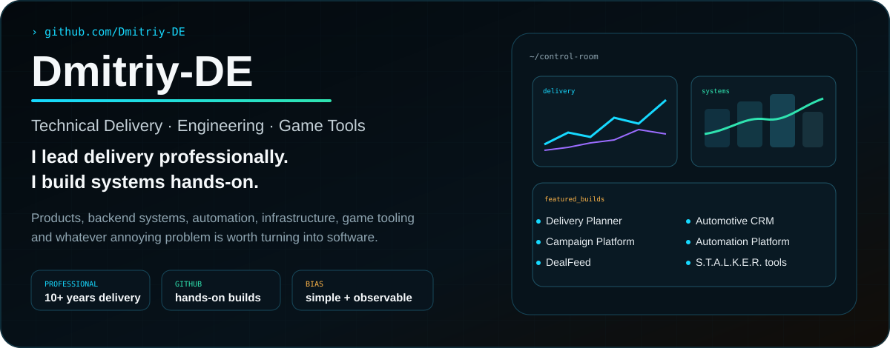

  
  
  
  
  
  
  
  

> **I like systems that are easy to explain, hard to misuse and boring to operate.**  
> Professionally I lead delivery. Here I build the products, tools and infrastructure myself.

  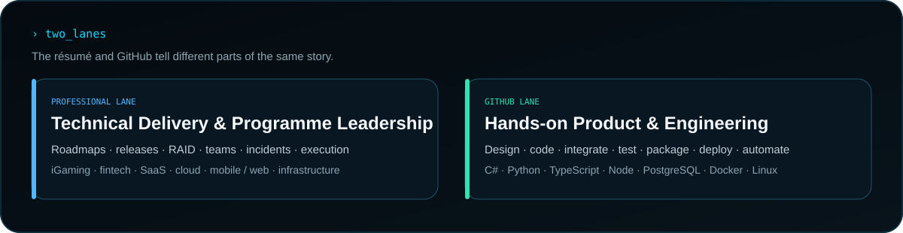

## Featured builds

<table>
<tr>
<td width="50%" valign="top">
<a href="https://github.com/Dmitriy-DE/delivery-planner-showcase">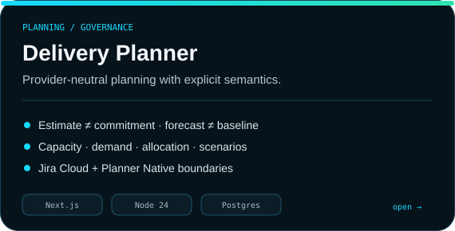</a>
</td>
<td width="50%" valign="top">
<a href="https://github.com/Dmitriy-DE/automotive-crm-showcase">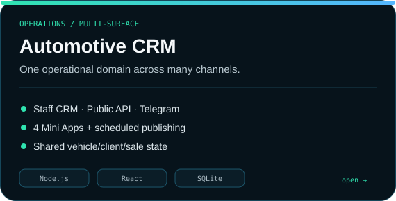</a>
</td>
</tr>
<tr>
<td width="50%" valign="top">
<a href="https://github.com/Dmitriy-DE/campaign-platform-showcase">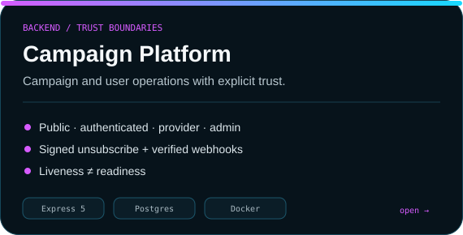</a>
</td>
<td width="50%" valign="top">
<a href="https://github.com/Dmitriy-DE/igaming-automation-platform-showcase">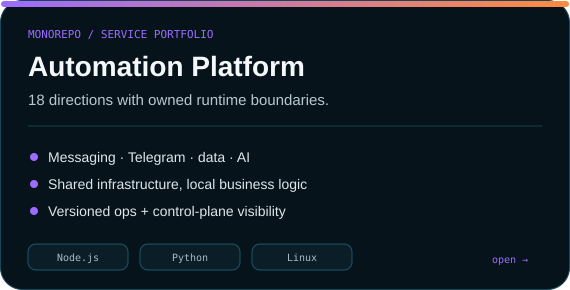</a>
</td>
</tr>
<tr>
<td width="50%" valign="top">
<a href="https://github.com/Dmitriy-DE/dealfeed-showcase">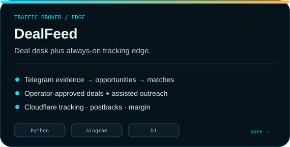</a>
</td>
<td width="50%" valign="top">
<a href="https://github.com/Dmitriy-DE/stalker-save-editor-showcase">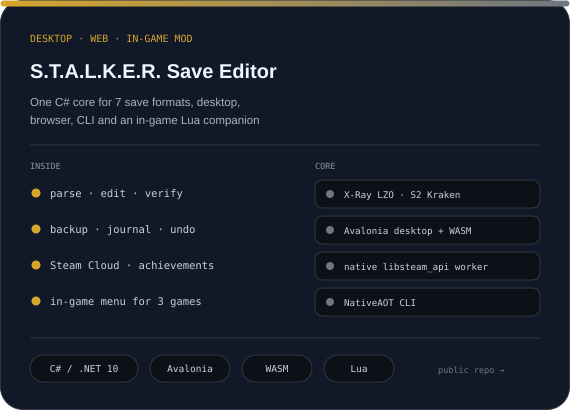</a>
</td>
</tr>
</table>

Click a card for the engineering showcase. Private-source projects expose architecture and product boundaries without publishing production internals.

## Engineering spectrum

  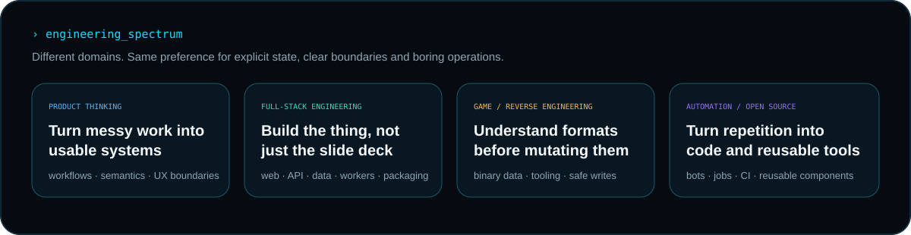

<table>
<tr>
<td width="25%" valign="top"><b>Domain clarity</b> Different facts stay different. Estimate is not commitment; forecast is not baseline; unknown is not zero.</td>
<td width="25%" valign="top"><b>Clear boundaries</b> Clients stay thin. Services own behaviour. Trust, data and runtime ownership are explicit.</td>
<td width="25%" valign="top"><b>Boring operations</b> Health, migrations, backups, logs and failure modes should be visible and repeatable.</td>
<td width="25%" valign="top"><b>Automation first</b> If the same boring work happens twice, it is probably trying to become code.</td>
</tr>
</table>

  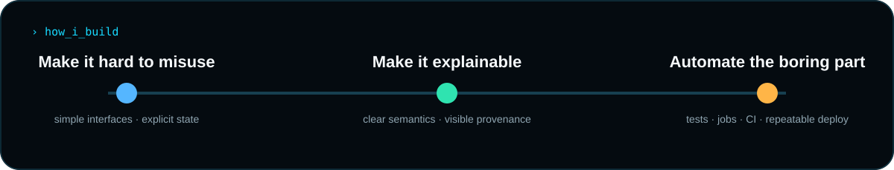

## Stack I actually use

<table>
<tr>
<td width="25%" valign="top"><b>Languages / runtimes</b> C# / .NET · Python · TypeScript · Node.js · Lua</td>
<td width="25%" valign="top"><b>Data / backend</b> PostgreSQL · SQLite · D1 · REST / OpenAPI · webhooks</td>
<td width="25%" valign="top"><b>UI / delivery</b> Avalonia · React · Next.js · WebAssembly · Telegram Mini Apps</td>
<td width="25%" valign="top"><b>Infrastructure</b> Docker · Linux · Cloudflare · GitHub Actions · packaging / release automation</td>
</tr>
</table>

  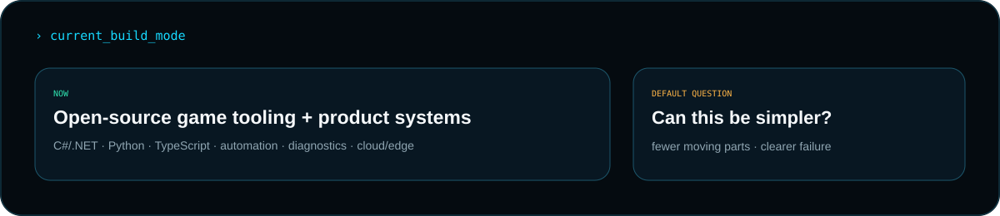

## Find me

  
  
  

Build things. Ship things. Make the boring parts disappear.
